# Reporte Técnico — Diagramas de Diseño  
## Sistema de Monitoreo de Transporte Público: TransTrack  

**Versión:** 2.0  
**Fecha:** 13 de mayo de 2026  
**Tecnologías base:** React 19 · Vite 8 · React-Leaflet 5 · Zustand 5 · TailwindCSS 4 · Node.js · Express 4 · Socket.io 4 · BullMQ 5 · Redis  

---

## Índice

1. [Diagrama de Arquitectura de Software](#1-diagrama-de-arquitectura-de-software)  
2. [Diagrama de Árbol de Componentes](#2-diagrama-de-árbol-de-componentes)  
3. [Diagrama de Flujo de Datos (Estado Global)](#3-diagrama-de-flujo-de-datos-estado-global)  
4. [Diagrama de Máquina de Estados — Unidades de Transporte](#4-diagrama-de-máquina-de-estados--unidades-de-transporte)  
5. [Diagrama de Flujo — Algoritmo de Simulación](#5-diagrama-de-flujo--algoritmo-de-simulación)  
6. [Diagrama de Flujo — Algoritmo de Encadenamiento de Rutas](#6-diagrama-de-flujo--algoritmo-de-encadenamiento-de-rutas)  
7. [Diagrama de Flujo — Planificador de Viaje](#7-diagrama-de-flujo--planificador-de-viaje)  
8. [Diagrama de Secuencia — Interacción del Usuario](#8-diagrama-de-secuencia--interacción-del-usuario)  
9. [Diagrama de Estructura de Datos](#9-diagrama-de-estructura-de-datos)  
10. [Diagrama de Capas del Sistema](#10-diagrama-de-capas-del-sistema)  

---

## 1. Diagrama de Arquitectura de Software

El sistema es ahora una arquitectura **full-stack** compuesta por una SPA React en el frontend y un servidor Node.js/Express en el backend. La comunicación en tiempo real se realiza mediante Socket.io; la cola de trabajo asíncrona mediante BullMQ sobre Redis. El frontend mantiene un store reactivo global (Zustand) como única fuente de verdad.

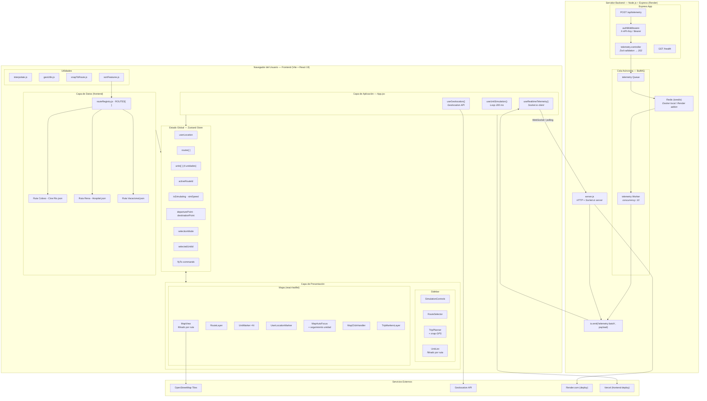

---

## 2. Diagrama de Árbol de Componentes

Jerarquía completa de componentes React con sus dependencias del store. Se destacan los cambios respecto a la versión anterior: filtrado de unidades por ruta, seguimiento de unidad en mapa, y hook de telemetría en tiempo real.

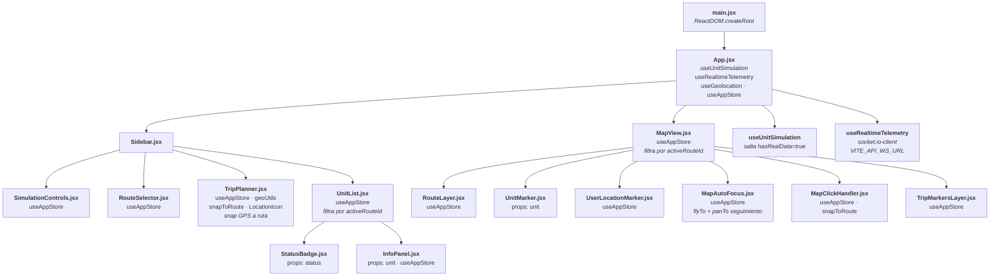

---

## 3. Diagrama de Flujo de Datos (Estado Global)

Incluye el flujo de telemetría en tiempo real desde el backend hacia el store y el mapa.

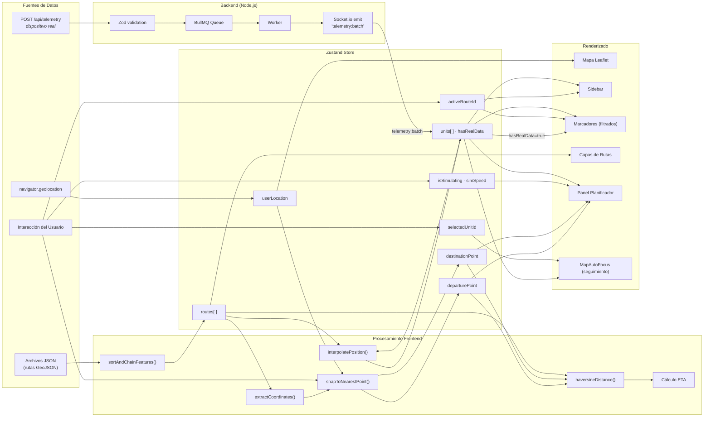

---

## 4. Diagrama de Máquina de Estados — Unidades de Transporte

Se añade la transición hacia **telemetría real**: cuando una unidad recibe datos del backend via Socket.io, adquiere el flag `hasRealData=true` y la simulación deja de controlar su posición.

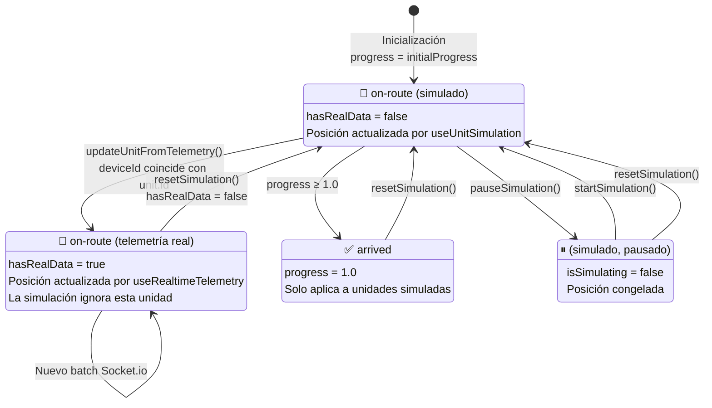

> **Nota:** Las unidades con `hasRealData=true` no transicionan a `arrived` ya que la simulación no controla su progreso. `resetSimulation()` restaura todas las unidades al estado simulado.

---

## 5. Diagrama de Flujo — Algoritmo de Simulación

Se añade la verificación de `hasRealData` como condición de salto, protegiend a las unidades con telemetría real de ser sobreescritas.

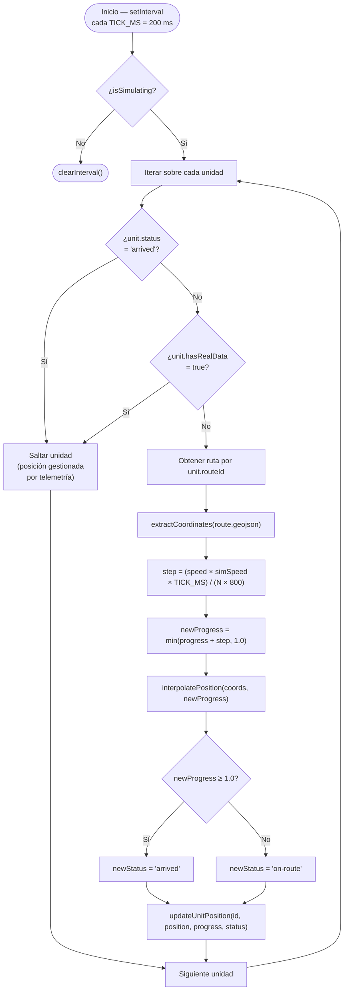

### Fórmula de velocidad angular

$$\text{step} = \frac{v \cdot s \cdot \Delta t}{N \cdot 800}$$

Donde:
- $v$ = velocidad individual de la unidad (por defecto 1)
- $s$ = `simSpeed` — multiplicador global de velocidad $\in [0.5, 3]$
- $\Delta t$ = 200 ms
- $N$ = número de coordenadas de la ruta
- $800$ = constante de escala para normalizar la velocidad percibida

---

## 6. Diagrama de Flujo — Algoritmo de Encadenamiento de Rutas

Sin cambios respecto a la versión anterior.

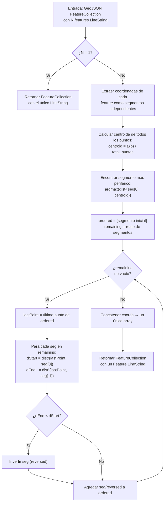

> **Complejidad:** $O(N^2)$ donde $N$ es el número de segmentos. Aceptable para rutas urbanas donde $N \leq 50$.

---

## 7. Diagrama de Flujo — Planificador de Viaje

Se añade la opción de **snap automático al punto más cercano desde la ubicación GPS** del usuario como alternativa al click manual en el mapa.

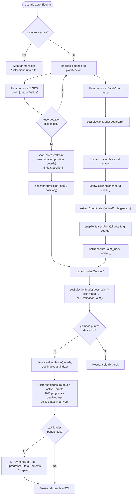

### Fórmula de ETA

$$\text{ETA}_u = \frac{(p_{\text{dep}} - p_u) \cdot T_{\text{ruta}}}{v_u \cdot 1000}$$

$$\text{ETA}_{\text{final}} = \min_{u \in U_{\text{pendientes}}} \text{ETA}_u$$

---

## 8. Diagrama de Secuencia — Interacción del Usuario

Flujo extendido que incluye telemetría en tiempo real desde el backend y el seguimiento de unidad desde el sidebar.

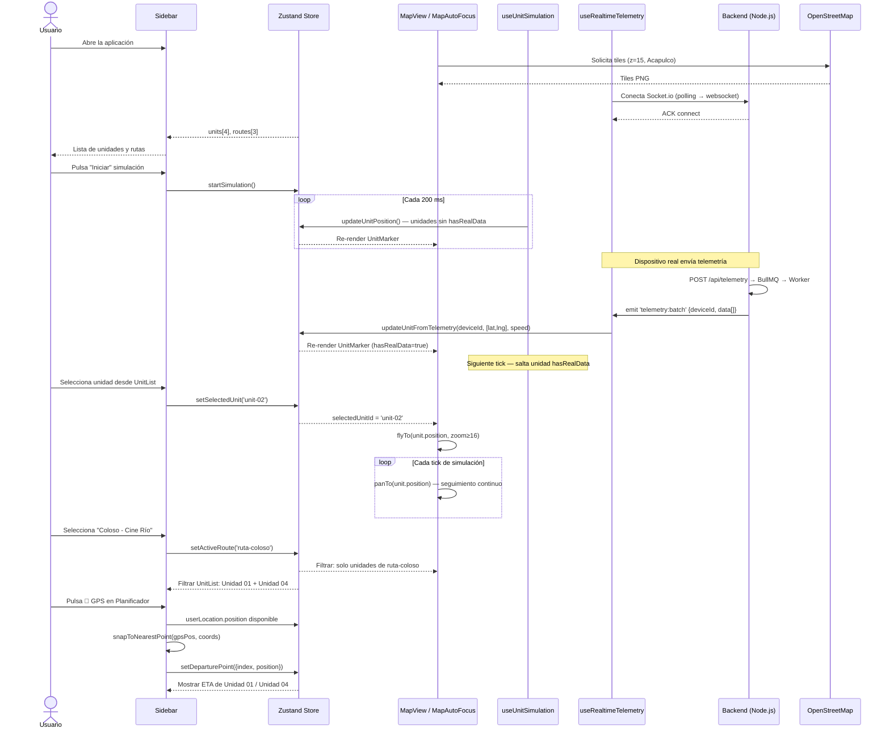

---

## 9. Diagrama de Estructura de Datos

Se añaden los modelos del backend (Job de telemetría, payload Socket.io) y el campo `hasRealData` en `UNIT`.

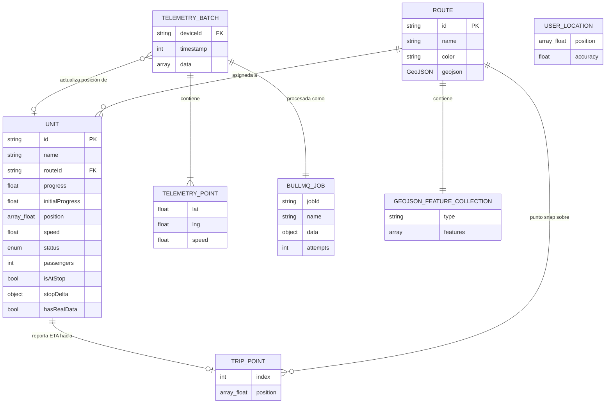

### Enumeración de estados (`unit.status`)

| Valor | Descripción |
|-------|-------------|
| `on-route` | Unidad en movimiento (simulada o con telemetría real) |
| `arrived` | Unidad completó el recorrido simulado (progress = 1.0) |

### Flag `hasRealData`

| Valor | Efecto |
|-------|--------|
| `false` | La posición es controlada por `useUnitSimulation` |
| `true` | La posición es controlada por `useRealtimeTelemetry`; la simulación ignora la unidad |

---

## 10. Diagrama de Capas del Sistema

El sistema pasa de frontend-only a arquitectura full-stack con capa de infraestructura real.

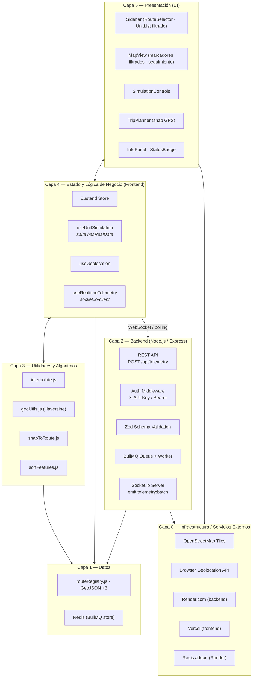

---

## Notas Técnicas Adicionales

### Conversión de coordenadas GeoJSON ↔ Leaflet

| Estándar | Orden |
|---------|-------|
| GeoJSON | `[longitude, latitude]` |
| Leaflet | `[latitude, longitude]` |

```js
geometry.coordinates.forEach(([lng, lat]) => coords.push([lat, lng]))
```

### Fórmula de Haversine

$$d = 2R \cdot \arctan2\!\left(\sqrt{a},\, \sqrt{1-a}\right)$$

$$a = \sin^2\!\left(\frac{\Delta\phi}{2}\right) + \cos\phi_1 \cdot \cos\phi_2 \cdot \sin^2\!\left(\frac{\Delta\lambda}{2}\right)$$

Donde $R = 6{,}371{,}000 \text{ m}$.

### Patrón de refs para el loop de simulación

```
isSimulating cambia → useEffect se re-ejecuta → nuevo interval
units cambia        → unitsRef.current = units  (sin re-crear interval)
simSpeed cambia     → simSpeedRef.current       (sin re-crear interval)
```

### Seguimiento de unidad en mapa (MapAutoFocus)

Dos `useEffect` independientes con dependencias distintas:

```
selectedUnitId cambia → flyTo(position, zoom≥16) + isFollowingRef = true
units cambia          → si isFollowing && posición cambió → panTo(position, duration:0.2)
selectedUnitId = null → isFollowingRef = false (detiene seguimiento)
```

### Autenticación del backend

El endpoint `POST /api/telemetry` requiere uno de los dos esquemas:

| Header | Formato |
|--------|---------|
| `X-API-Key` | `<token>` |
| `Authorization` | `Bearer <token>` |

La comparación se realiza con `timingSafeEqual` para prevenir timing attacks. El token se genera automáticamente en Render mediante `generateValue: true`.


---

## Índice

1. [Diagrama de Arquitectura de Software](#1-diagrama-de-arquitectura-de-software)  
2. [Diagrama de Árbol de Componentes](#2-diagrama-de-árbol-de-componentes)  
3. [Diagrama de Flujo de Datos (Estado Global)](#3-diagrama-de-flujo-de-datos-estado-global)  
4. [Diagrama de Máquina de Estados — Unidades de Transporte](#4-diagrama-de-máquina-de-estados--unidades-de-transporte)  
5. [Diagrama de Flujo — Algoritmo de Simulación](#5-diagrama-de-flujo--algoritmo-de-simulación)  
6. [Diagrama de Flujo — Algoritmo de Encadenamiento de Rutas](#6-diagrama-de-flujo--algoritmo-de-encadenamiento-de-rutas)  
7. [Diagrama de Flujo — Planificador de Viaje](#7-diagrama-de-flujo--planificador-de-viaje)  
8. [Diagrama de Secuencia — Interacción del Usuario](#8-diagrama-de-secuencia--interacción-del-usuario)  
9. [Diagrama de Estructura de Datos](#9-diagrama-de-estructura-de-datos)  
10. [Diagrama de Capas del Sistema](#10-diagrama-de-capas-del-sistema)  

---

## 1. Diagrama de Arquitectura de Software

El sistema sigue una arquitectura de **SPA (Single Page Application)** con separación de responsabilidades en capas. La gestión de estado es centralizada mediante un store reactivo global (Zustand), eliminando el prop-drilling entre componentes distantes.

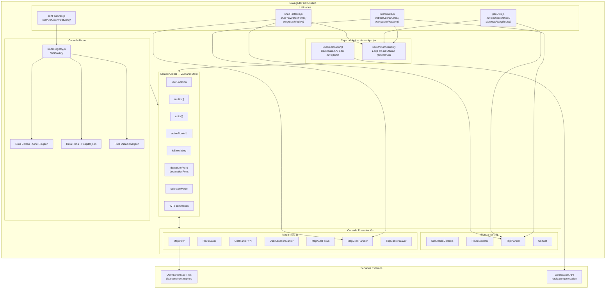

---

## 2. Diagrama de Árbol de Componentes

Jerarquía completa de componentes React con sus dependencias del store y utilidades.

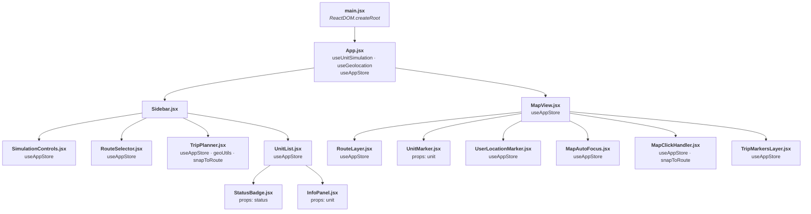

---

## 3. Diagrama de Flujo de Datos (Estado Global)

Muestra cómo los datos fluyen desde las fuentes externas, pasando por el store Zustand, hacia los componentes de presentación.

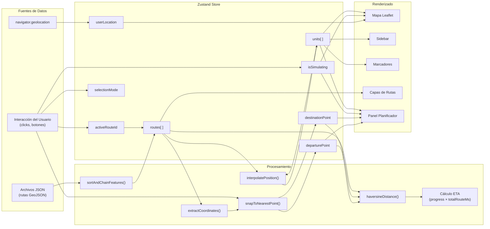

---

## 4. Diagrama de Máquina de Estados — Unidades de Transporte

Cada unidad de transporte tiene un ciclo de vida definido por tres estados. La transición entre ellos es determinista y controlada por el hook `useUnitSimulation`.

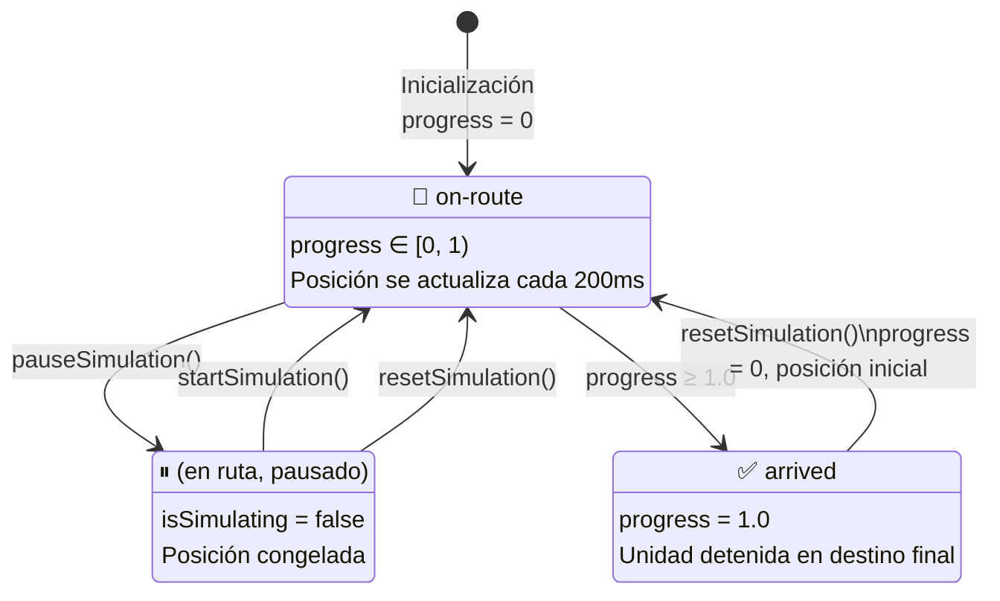

> **Nota:** El estado `arrived` es terminal durante la sesión activa. Solo `resetSimulation()` permite regresar al estado inicial.

---

## 5. Diagrama de Flujo — Algoritmo de Simulación

El hook `useUnitSimulation` ejecuta un loop de interpolación lineal por posición cada 200 ms. El algoritmo traduce el progreso normalizado `t ∈ [0,1]` en coordenadas geográficas `[lat, lng]`.

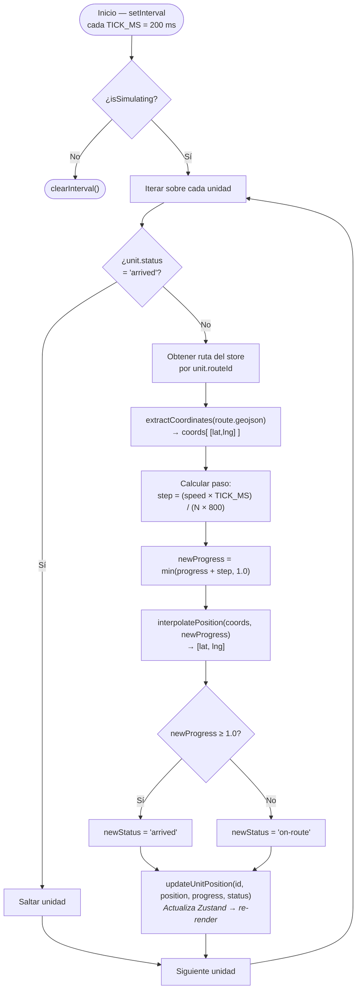

### Fórmula de velocidad angular

El paso por tick se define como:

$$\text{step} = \frac{v \cdot \Delta t}{N \cdot 800}$$

Donde:
- $v$ = factor de velocidad de la unidad (adimensional, por defecto 1)
- $\Delta t$ = 200 ms (periodo del intervalo)
- $N$ = número de coordenadas de la ruta
- $800$ = constante de escala para normalizar la velocidad percibida

---

## 6. Diagrama de Flujo — Algoritmo de Encadenamiento de Rutas

La función `sortAndChainFeatures()` resuelve el problema de múltiples `LineString` en un `FeatureCollection` GeoJSON que no están ordenados secuencialmente. Produce un único `LineString` continuo.

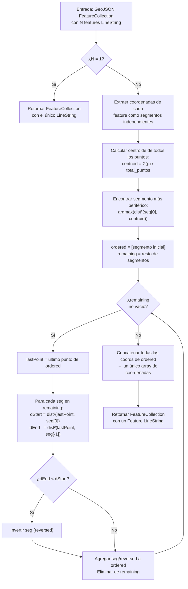

> **Complejidad:** $O(N^2)$ donde $N$ es el número de segmentos. Aceptable para rutas urbanas donde $N \leq 50$.

---

## 7. Diagrama de Flujo — Planificador de Viaje

El planificador permite al usuario marcar dos puntos sobre la ruta activa y calcula distancia por polilínea y ETA de la unidad más cercana.

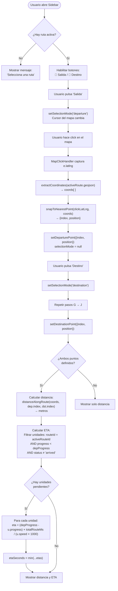

### Fórmula de ETA

$$\text{ETA}_u = \frac{(p_{\text{dep}} - p_u) \cdot T_{\text{ruta}}}{v_u \cdot 1000}$$

Donde:
- $p_{\text{dep}}$ = progreso normalizado del punto de salida $\in [0,1]$
- $p_u$ = progreso actual de la unidad $u$
- $T_{\text{ruta}} = N \cdot 800 \text{ ms}$ = duración total estimada de la ruta
- $v_u$ = factor de velocidad de la unidad

$$\text{ETA}_{\text{final}} = \min_{u \in U_{\text{pendientes}}} \text{ETA}_u$$

---

## 8. Diagrama de Secuencia — Interacción del Usuario

Flujo completo de una sesión típica de usuario: selección de ruta, planificación de viaje y seguimiento de unidad.

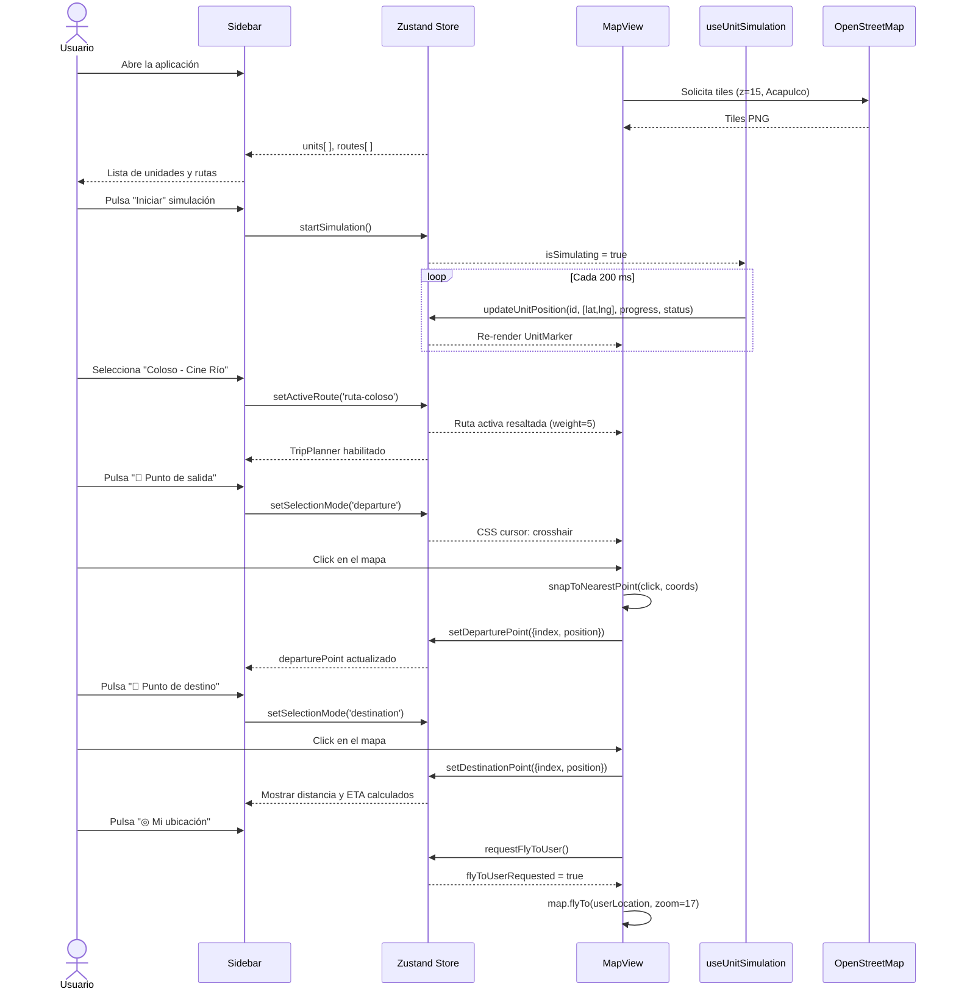

---

## 9. Diagrama de Estructura de Datos

Define los modelos de datos internos del sistema y sus relaciones.

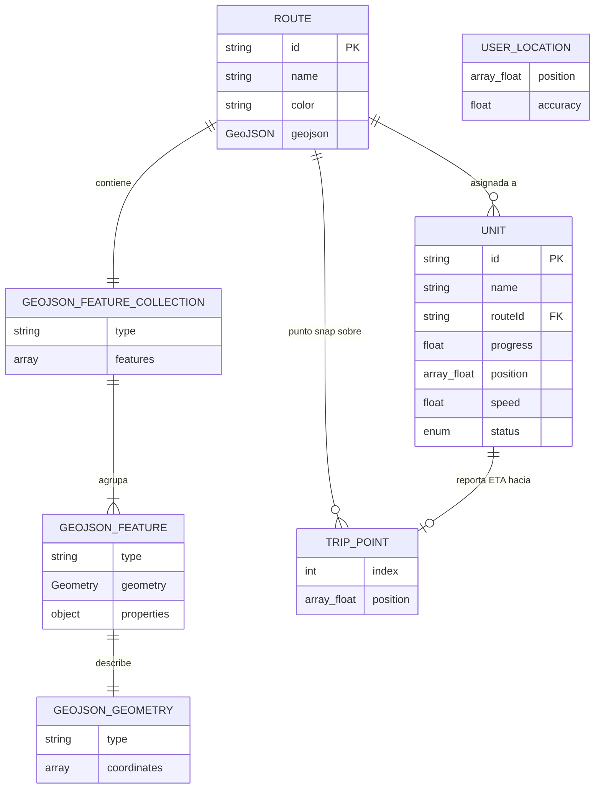

### Enumeración de estados (`unit.status`)

| Valor | Descripción |
|-------|-------------|
| `on-route` | La unidad se está moviendo activamente por su ruta |
| `arrived` | La unidad completó el recorrido (progress = 1.0) |

### Tipos GeoJSON soportados

| Tipo de geometría | Soporte |
|-------------------|---------|
| `LineString` | ✅ Completo |
| `MultiLineString` | ✅ Completo |
| `Point` | ❌ No utilizado |
| `Polygon` | ❌ No utilizado |

---

## 10. Diagrama de Capas del Sistema

Vista de las capas de abstracción del sistema, desde la infraestructura hasta la interfaz de usuario.

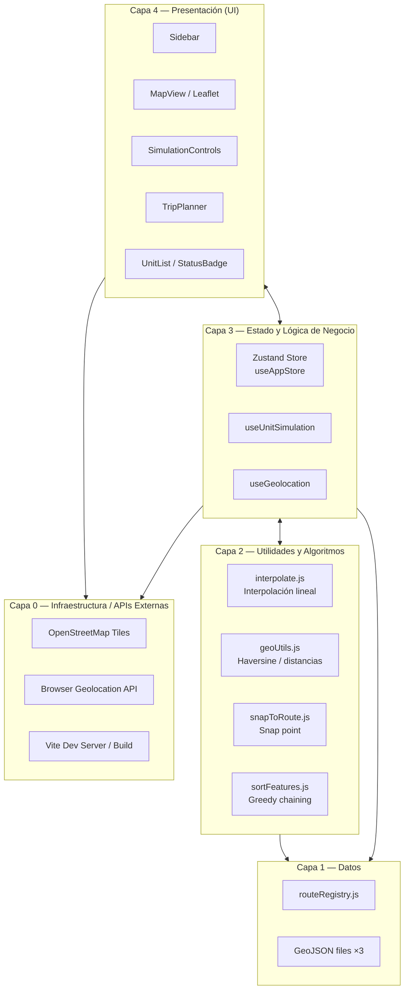

---

## Notas Técnicas Adicionales

### Conversión de coordenadas GeoJSON ↔ Leaflet

Un punto crítico del sistema es la inversión de ejes entre el estándar GeoJSON (RFC 7946) y Leaflet:

| Estándar | Orden |
|---------|-------|
| GeoJSON | `[longitude, latitude]` |
| Leaflet | `[latitude, longitude]` |

La función `extractCoordinates()` realiza esta conversión automáticamente al procesar los archivos JSON:

```js
geometry.coordinates.forEach(([lng, lat]) => coords.push([lat, lng]))
```

### Fórmula de Haversine

Usada en `geoUtils.js` para calcular distancias geodésicas exactas entre dos puntos sobre la superficie terrestre:

$$d = 2R \cdot \arctan2\!\left(\sqrt{a},\, \sqrt{1-a}\right)$$

$$a = \sin^2\!\left(\frac{\Delta\phi}{2}\right) + \cos\phi_1 \cdot \cos\phi_2 \cdot \sin^2\!\left(\frac{\Delta\lambda}{2}\right)$$

Donde $R = 6{,}371{,}000 \text{ m}$ es el radio medio de la Tierra.

### Patrón de refs para el loop de simulación

El hook `useUnitSimulation` utiliza `useRef` para evitar la re-creación del `setInterval` en cada actualización del estado:

```
isSimulating cambia → useEffect se re-ejecuta → nuevo interval
units cambia       → unitsRef.current = units  (sin re-crear interval)
routes cambia      → routesRef.current = routes (sin re-crear interval)
```

Este patrón es una solución estándar al problema de *stale closure* en React hooks con timers.
